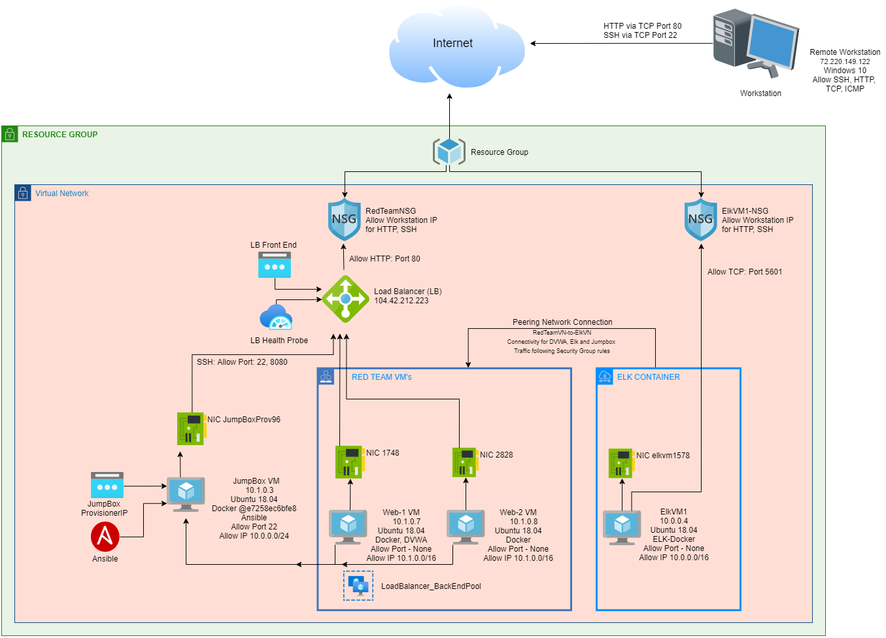

# Project-1
Class project to configure an ELK stack server in order to set up a cloud monitoring system

The main purpose of this network is to expose a load-balanced and monitored instance of DVWA, the Dam Vulnerable Web Application.

**Load balancing ensures that the application will be highly RESPONSIVE, in addition to restricting ACCESS to the network.**

-  What aspect of security do load balancers protect? What is the advantage of a jump box?
	**The main server by distributing, for example, a DDoS attack to the cloud server.  It’s the first access point a user must be authorized to use before moving into the more high level servers that have sensitive data.**

**Integrating an ELK server allows users to easily monitor the vulnerable VMs for changes to the DATA and system LOGS.**

- What does Filebeat watch for? 
**Gathers specific log files and sends them to Elasti/Logstash.**
- What does Metricbeat record? 
**Gathers metrics and stats to forward them to Elasti/Logstash.**

The configuration details of each machine may be found below.

|Name |	Function |	IP Address	| Operating System|
|-----|-----------|--------------|-----------------|
|Jump Box |	Admin Server	| 10.1.0.3	| Linux 
|Web1 |	Web-Server |	10.1.0.7	| Linux 
|Web2 |	Web-Server |	10.1.0.8	| Linux 
|ElkVM1 |	Log Server |	10.0.0.4	| Linux 

### Access Policies

The machines on the internal network are not exposed to the public Internet. 

**Only the ELK SERVER machine can accept connections from the Internet. Access to this machine is only allowed from the following IP addresses:**
- **Workstations through TCP 5601**
- **Elk Server 5600, 9200, 5044**

Machines within the network can only be accessed by Jumpbox.
- **Which machine did you allow to access your ELK VM? What was its IP address?
     All machines allowed on port 22 and 8080 through SSH, IP 10.1.0.3
     Jumpbox through SSH port 22
    Webserver to Elk Server through Port 22, and allowed ports through Elk Ports.**

A summary of the access policies in place can be found in the table below.

|Name |	Publicly Accessible	| Allowed IP Addresses |
|-----|---------------------|----------------------|
|Jump Box	| Yes 	| 10.1.0.3 through Port 22
|Web1	| No 	| 10.1.0.7 
|Web2 |	No |	10.1.0.8 
|Elk Server	|Yes	| From Workstation, 5601

### Elk Configuration

Ansible was used to automate configuration of the ELK machine. No configuration was performed manually, which is advantageous because…
**Administrators can deploy virtual machines in a network in bulk making it much faster to get up and running.  **

- What is the main advantage of automating configuration with Ansible? 
- **So that system administrators can put together the software package custom to a series of machines quickly and easily.  It makes the process faster and saves time.**  

The playbook implements the following tasks:
 In 3-5 bullets, explain the steps of the ELK installation play. E.g., install Docker; download image; etc.
- **Install Docker with the Image**
- **Install Elasticsearch and Kibana**
- **Start and Attach to your Container**
- **Test your connection from the Web Browser on Kibana**
- **Test data being transmitted with failed logins via SSH and verify in Kibana**

The following screenshot displays the result of running `docker ps` after successfully configuring the ELK instance.

 **Name: elk  Container ID: ec11bb2a1422 Filename: sudo docker ps.png**

## Target Machines & Beats
This ELK server is configured to monitor the following machines:

- List the IP addresses of the machines you are monitoring
**DVWA or Web1: 10.1.0.7**
**DVWA or Web2: 10.1.0.8**

We have installed the following Beats on these machines:
- **FILEBEAT**
- **METRICBEAT**

These Beats allow us to collect the following information from each machine:
-  In 1-2 sentences, explain what kind of data each beat collects, and provide 1 example of what you expect to see. 
Filebeat collects logs of data for Kibana.
Metricbeat organizes the stats in Kibana.

### Using the Playbook
In order to use the playbook, you will need to have an Ansible control node already configured. Assuming you have such a control node provisioned: 

- Which file is the playbook? Where do you copy it? 
Ansible-playbook.yml from the Day 1 Student Guide.

- Which file do you update to make Ansible run the playbook on a specific machine? How do I specify which machine to install the ELK server on versus which to install Filebeat on?
Edit the Hosts file to update and make Ansible run on specific machine, and specify which machine to install ELK server on.

- Which URL do you navigate to in order to check that the ELK server is running?
<ElkServer IP>:5601 

As a **Bonus**, provide the specific commands the user will need to run to download the playbook, update the files, etc.
Ansible-playbook install-elk.yml

